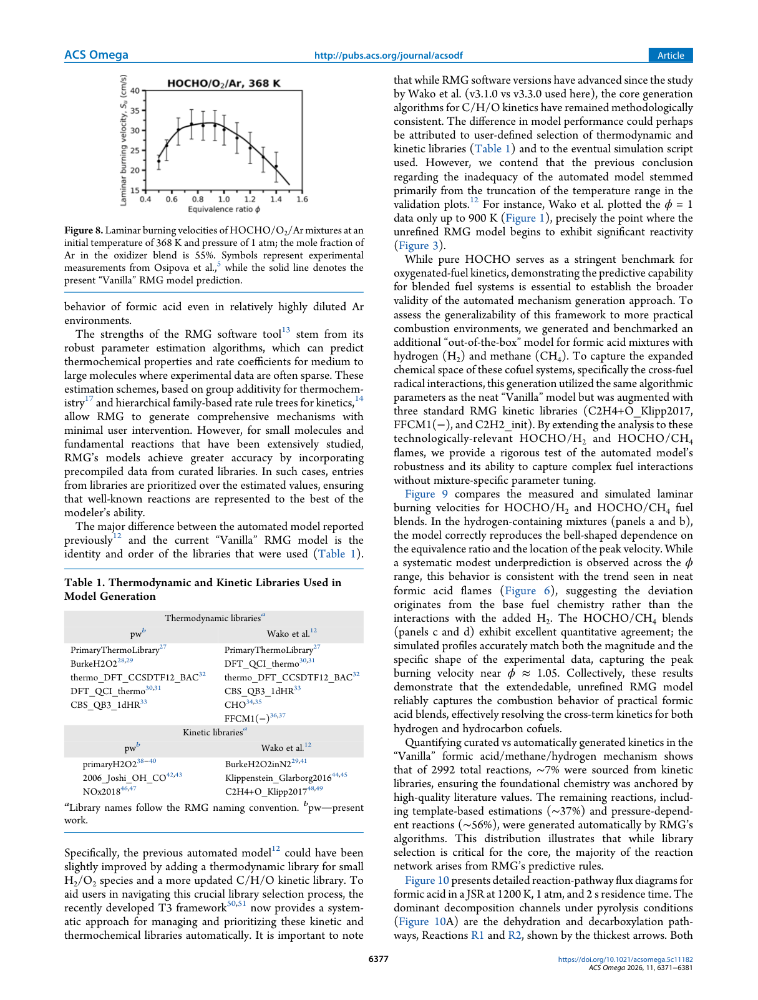
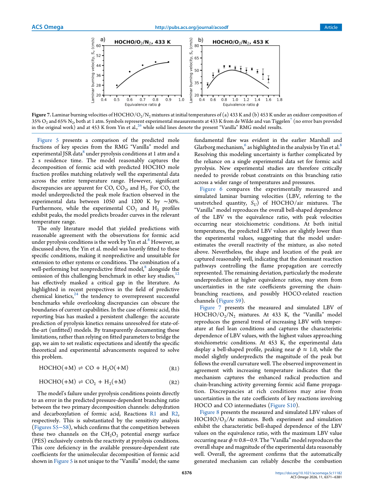

# Flux Diagram Analysis: Using RMG Out-of-the-Box for Formic Acid Pyrolysis and Oxidation

## Paper Summary
- **Found Flux Diagrams:** Yes
- **Number of Flux Diagrams:** 1
- **Overall Usefulness:** high

### Recommended Actions
- Review Figure 10 for detailed pathway information.
- Compare extracted pathways with theoretical mechanism models.

## Detected Figures

### Figure 10 (Page 7)

**Caption:** Figure 10 presents detailed reaction-pathway flux diagrams for
formic acid in a JSR at 1200 K, 1 atm, and 2 s residence time. The
dominant decomposition channels under pyrolysis conditions
(Figure 10A) are the dehydration and decarboxylation path-
ways, Reactions R1 and R2, shown by the thickest arrows. Both
**Classification:** flux diagram (Confidence: 0.95)
**Reasoning:** The caption explicitly describes 'reaction-pathway flux diagrams' with 'thickest arrows' indicating flux representation, which is characteristic of flux diagrams.

#### Flux Analysis
- **System:** Formic acid pyrolysis
- **Conditions:** {'temperature': '1200 K', 'pressure': '1 atm', 'equivalence_ratio': 'unknown', 'residence_time': '2 s'}
- **Major Species:** Formic acid, H2O, CO, CO2, H2

**Dominant Pathways:**
- Formic acid → H2O + CO (high importance)
- Formic acid → CO2 + H2 (high importance)

---
### Figure 6 (Page 6)

**Caption:** Figure 6 compares the experimentally measured and
simulated laminar burning velocities (LBV, referring to the
unstretched quantity, SU) of HOCHO/air mixtures. The
“Vanilla” model reproduces the overall bell-shaped dependence
of the LBV vs the equivalence ratio, with peak velocities
occurring near stoichiometric conditions. At both initial
temperatures, the predicted LBV values are slightly lower than
the experimental values, suggesting that the model under-
estimates the overall reactivity of the mixture, as also noted
above. Nevertheless, the shape and location of the peak are
captured reasonably well, indicating that the dominant reaction
pathways controlling the flame propagation are correctly
represented. The remaining deviation, particularly the moderate
underprediction at higher equivalence ratios, may stem from
uncertainties in the rate coefficients governing the chain-
branching reactions, and possibly HOCO-related reaction
channels (Figure S9).
**Classification:** other (Confidence: 0.9)
**Reasoning:** The caption and context describe a figure comparing experimentally measured and simulated laminar burning velocities (LBV) vs. equivalence ratio, which is a plot of a physical property (burning velocity) against a reaction condition (equivalence ratio), not fitting into the specified categories like flux diagram, PES, molecular structure, sensitivity analysis, species profile, or mechanism schematic.

---